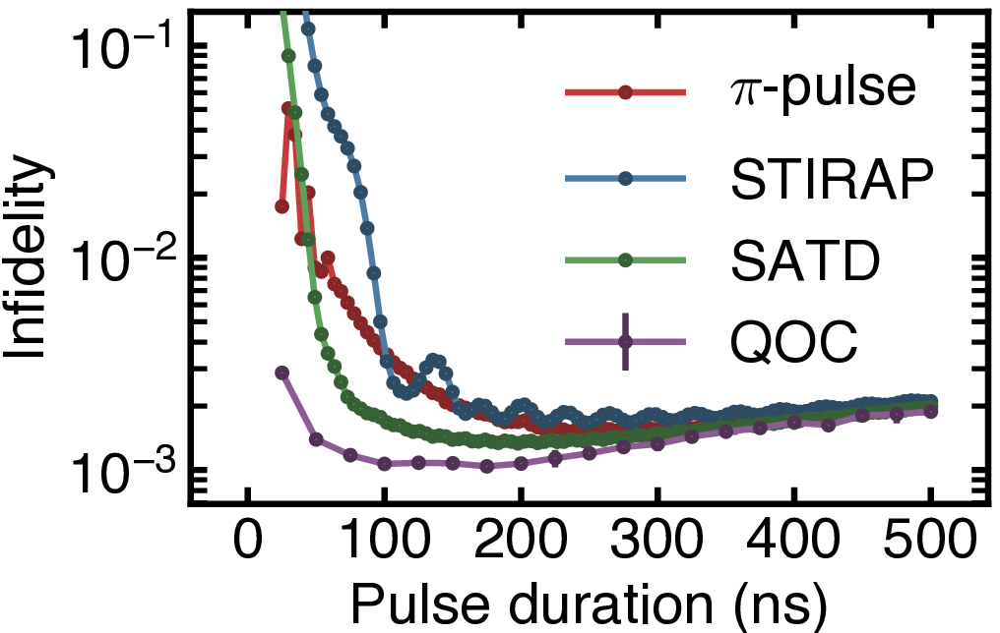

# Synthesizing Fast, Robust, and High-Fidelity Adiabatic Control Pulses for Rydberg Atom Arrays

This repository provides code for optimizing control pulses in Rydberg atom arrays via an optimal control framework grounded in the Van Loan formalism. Our method delivers high-fidelity quantum operations that are fast and robust to experimental parameter fluctuations.

## Overview

- Goal: Achieve rapid, high-fidelity quantum gates and state transfers in Rydberg arrays.  
- Robustness: The framework incorporates techniques to mitigate sensitivity to parameter noise or deviations.  
- Approach: Combines adiabatic seeding with Gaussian pulse expansions, all optimized under the Van Loan scheme for efficient state evolution and fidelity calculations.

## Framework

- Gaussian basis expansion  
  Control pulses are expanded as $\Omega(t) = \sum_{n=1}^{N} a_n \exp\!\bigl[-(t - b_n)^2 / c_n^2\bigr]$, giving $3N$ pulse parameters.

- Adiabatic initial seeding  
  Optimization begins with parameters that approximate standard adiabatic protocols, reducing the search space and improving convergence.

- Optimization metrics  
  The cost function includes both fidelity (to measure successful state preparation or gating) and adiabatic measures (ensuring smooth parameter evolution).

- Van Loan formalism  
  Enables efficient propagator computations for multi-parameter optimization, accelerating both forward evolution and gradient evaluations.

## Examples

  

A few illustrative Jupyter notebooks are included:

- **[01_state_transfer.ipynb](code/notebooks/01_state_transfer.ipynb)**  
  Demonstrates a fast, high-fidelity state transfer protocol (fidelity $\sim 99.92\%$) that mimics SATD methods yet outperforms them in speed and robustness.

- **[02_two_qubit_gate.ipynb](code/notebooks/02_two_qubit_gate.ipynb)**  
  Implements a global Rydberg $\text{CZ}$ gate

